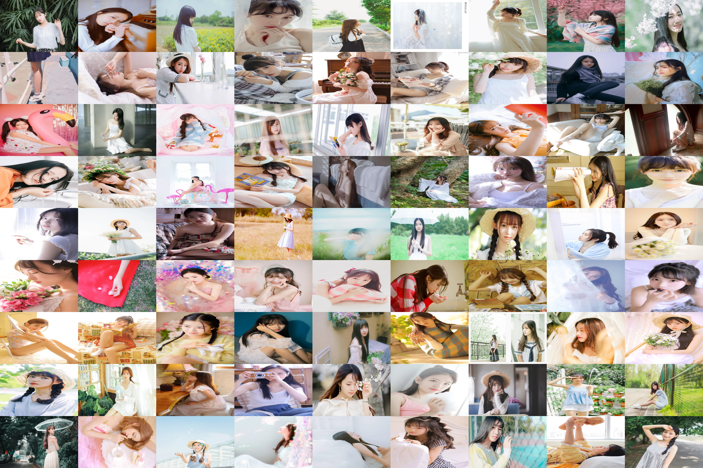
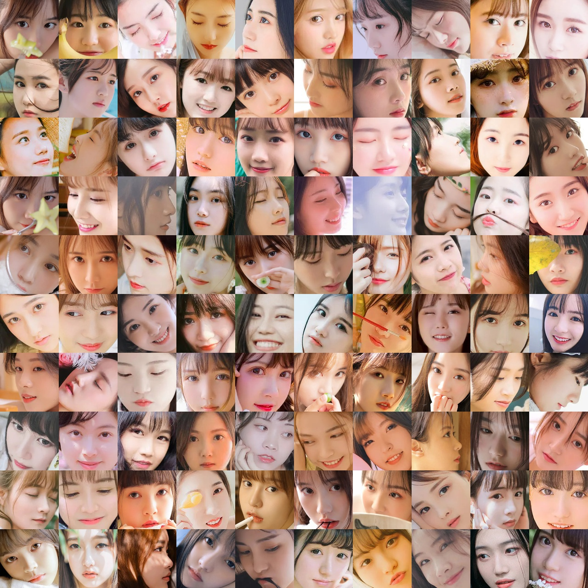

# Introduction
Crawl images based on `Python` from the website [vmgrils.com](https://www.vmgirls.com/). Then, You can detect and extract faces from these images crawled to make a dataset for deep learning training, if you want.
# Install
The following modules must be installed for images crawling.
```bash
pip install requests
pip install BeautifulSoup4
pip install fake_useragent
pip install tqdm
```
The following modules must be installed for faces detection.
```bash
pip install opencv-python
pip install dlib
pip install tqdm
```
# Usage
Crawl almost all images of the website [vmgrils.com](https://www.vmgirls.com/).
```bash
python main.py
```
Randomly choice 81 images from the crawled images and view.
```bash
python show.py
```
Detect and extract faces from the images crawled to make a dataset for deep learning training.
```bash
python face.py
```
Filter face images whose width and height are both greater than 128, and resize them to 128x128.
```bash
pyhton face-processing.py
```
Show face images after filter and resize.
```bash
pyhton show-processing.py
```
# Result
## Single-Image-Preview

## Multi-Images-Preview

## Face-Images-After-Filter-And-Resize.

## Data of Craweling
| Item |Details|
|:--:|:--:|
| Website | [https://www.vmgirls.com/](https://www.vmgirls.com/) |
| Sitemap | [https://www.vmgirls.com/sitemap.html](https://www.vmgirls.com/sitemap.html) |
| Date of crawling | 2021年4月28日 |
| Total number of images | 17601 |
| Total size of images | 1,742,902,332 Byte(About 1.62 GB) |
| Total number of faces | 13960 |
| Types of images | png, jpg, jpeg |
| Link of repository | [https://github.com/XavierJiezou/python-vmgirls-crawl/](https://github.com/XavierJiezou/python-vmgirls-crawl/) |
# Download
- 17601 images from [vmgrils.com](https://www.vmgirls.com/): [download](https://j8rd-my.sharepoint.com/:u:/g/personal/25_t_skings_club/EckREf4k2_VMikBPOPCJqmUBZKz9V3fD_IK_rMbVLtcaLg?e=VULXqS)
- 13960 face images after face detection: [download](https://j8rd-my.sharepoint.com/:u:/g/personal/25_t_skings_club/ER0i4UMyAeJFuhx_q_kL86cBU9TJ9THh0XO2xZXuGVTIHw?e=kAMiIW)
- 8768 face images after after filter and resize: [download](https://j8rd-my.sharepoint.com/:u:/g/personal/25_t_skings_club/EUir3sPXP99EnKu40rh1yO8BNhc9FF_6aoEwGIrILK5JUw?e=rZWhB7)
# Cite
> [https://github.com/psf/requests](https://github.com/psf/requests)

> [https://beautifulsoup.readthedocs.io/zh_CN/v4.4.0/](https://beautifulsoup.readthedocs.io/zh_CN/v4.4.0/)

> [https://github.com/hellysmile/fake-useragent](https://github.com/hellysmile/fake-useragent)

> [https://github.com/tqdm/tqdm](https://github.com/tqdm/tqdm)